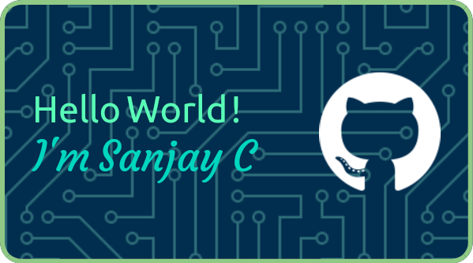

<h4> Student at Annamalai University</h4>

      
      

 
      

#  About Me:
- 🌱 I’m Currently Learning Web Development & Machine Learning 
- 🎭 **Fun fact** :  
   
     *May Be, I'm happy. But am Asymptomatic* 😌☺️

## 🔧 Skills & Tools 

 
      &nbsp;&nbsp;
      &nbsp;&nbsp;
      &nbsp;&nbsp;
      

## 📫 Connect with me

     &nbsp;&nbsp;
     &nbsp;&nbsp;
     

# 📈 Stats

     

 

      

 

       

## 🔝 Top Contributed Repo

     

## ✍️ Quote

     

     

